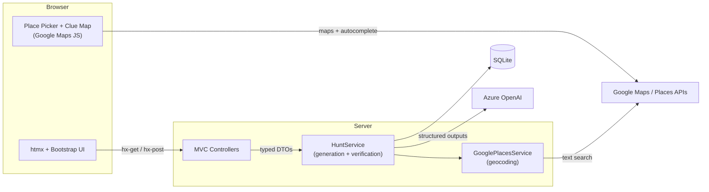

# Scavengy

An AI-powered scavenger hunt builder. Pick a real city, and Scavengy generates a themed set of riddle clues — each pointing to a real, publicly accessible landmark, verified and geocoded against Google Places — then plots them on an interactive map.

Built as a full-stack .NET application with a layered, message-based architecture: ASP.NET Core MVC + htmx on the front, ServiceStack services over EF Core behind it, and third-party integrations (Azure OpenAI, Google Places) isolated behind typed clients.

## Features

- **Create hunts** for any real city — the location field uses Google's Place Picker component (cities only), and the server independently rejects submissions without a selected place
- **AI clue generation** — Azure OpenAI produces riddle-style clues constrained by a strict JSON Schema (structured outputs), with prompt rules that forbid name leakage in clues and require real, verifiable landmarks
- **Landmark verification & geocoding** — every AI-suggested landmark is looked up against the Google Places API; clues are dropped if the landmark can't be found, resolves to the wrong city (a "Glenview, KY" hunt won't accept a match in Glenview, IL), or falls outside a 10-mile radius of the hunt's center (haversine distance check)
- **Interactive clue map** — hunt details render geocoded clues as numbered pins on a Google Map (Advanced Markers), with info windows showing each landmark's name and address, auto-fit to bounds
- **Hunt management** — rename, delete, and view hunts with live table updates and no full-page reloads
- **Clue regeneration** — hunts whose initial generation failed can regenerate on demand from the details page
- **Graceful degradation** — hunt creation always succeeds even if clue generation fails; the UI surfaces a warning toast and offers regeneration instead of erroring out

## Tech Stack

| Layer | Technology |
|---|---|
| Runtime | .NET 10 / C# |
| Web framework | ASP.NET Core MVC |
| Service layer | ServiceStack (message-based DTO services) |
| Data access | Entity Framework Core + SQLite |
| Schema documentation | T-SQL DDL scripts (`DatabaseScripts/`) |
| AI | Azure OpenAI (chat completions with strict JSON Schema structured outputs) |
| Geo | Google Places API text search (server-side) · Maps JavaScript API with Advanced Markers · Place Picker web component |
| Frontend | htmx (hypermedia-driven partial swaps), Bootstrap 5 |

## Architecture



- **`Scavengy.ServiceModel`** — plain DTOs and entities with REST route contracts (`/hunts`, `/hunts/{id}`, `/hunts/{id}/clues`). The contract layer has no dependencies on web or data concerns.
- **`Scavengy.ServiceInterface`** — all business logic: the clue generation/verification pipeline in `HuntService`, and the Places geocoding client. Controllers never touch the DbContext; they dispatch typed request messages through the ServiceStack gateway.
- **`Scavengy` (web)** — thin MVC controllers that return server-rendered partials for htmx to swap in. Cross-component UI updates (modal closing, empty-state toggling, failure toasts) are driven by `HX-Trigger` response headers rather than client-side state.

## Engineering Decisions Worth Noting

- **LLM output is schema-enforced, not parsed hopefully.** Clue generation uses Azure OpenAI's strict JSON Schema response format (`jsonSchemaIsStrict: true`), so malformed model output is rejected at the API boundary instead of crashing deserialization.
- **AI output is verified against ground truth before it's persisted.** The model is treated as a proposer, not an authority: every landmark it suggests must geocode successfully via Google Places, match the expected city (address components are checked to catch same-name-city collisions), and sit within a 10-mile haversine radius of the hunt's center. Clues that fail any check are dropped and logged, and the surviving clues are re-indexed — hallucinated or misplaced landmarks never reach the database.
- **Prompt engineering with hard rules.** The system prompt bans clue text from containing any form of the landmark's name (with worked good/bad examples), requires real verifiable places, bounds how far afield the model may reach for small towns, and forbids duplicates — treating the prompt as a spec, not a vibe.
- **Validation on both sides of the wire.** The place picker populates a hidden field only when a real place is selected, and the server independently rejects blank locations — client convenience never substitutes for server enforcement.
- **Failure modes are designed, not discovered.** External calls (OpenAI, Places) log via `ILogger` and degrade to safe defaults; a hunt is never lost because a third-party API had a bad day. Configuration that must exist fails fast at startup with a clear message.
- **SQL schema is documented as T-SQL DDL** (`DatabaseScripts/001.CreateTables.sql`) with keys, identity columns, nullability, and cascade behavior spelled out — the runtime uses EF Core/SQLite, but the relational design stands on its own and ports directly to SQL Server.
- **Dependency injection throughout** — typed `HttpClient` via `IHttpClientFactory` for Places (with a field mask limiting the response to exactly the data used), constructor-injected services, configuration bound from `appsettings` sections, and secrets kept in gitignored local config.

## Data Model

```
Hunts 1 ──── * Clues (FK HuntId, ON DELETE CASCADE)
```

Each `Clue` stores its verified landmark's `LocationAddress`, `Latitude`, and `Longitude` alongside the riddle text — populated by the geocoding pipeline at generation time and consumed by the map view.

## Getting Started

**Prerequisites:** .NET 10 SDK · an Azure OpenAI resource (chat model deployment) · a Google Cloud API key with Places API (New) and Maps JavaScript API enabled

1. Clone the repo and create `Scavengy/appsettings.Development.json` (gitignored):

```json
{
  "AzureOpenAI": {
    "Endpoint": "https://<your-resource>.openai.azure.com/",
    "ApiKey": "<key>",
    "DeploymentName": "<deployment>"
  },
  "GooglePlaces": {
    "ApiKey": "<key>"
  }
}
```

2. Run:

```bash
dotnet run --project Scavengy
```

The SQLite database is created automatically on first run. To run without AI (no clue generation), set `AiClueGeneration:Mode` to `none` in `appsettings.json`.

## API Surface

| Route | Verb | Action |
|---|---|---|
| `/hunts` | POST | Create hunt (triggers clue generation + verification) |
| `/hunts` | GET | List hunts |
| `/hunts/{id}` | GET | Get hunt |
| `/hunts/{id}` | PUT | Rename hunt |
| `/hunts/{id}` | DELETE | Delete hunt (cascades clues) |
| `/hunts/{id}/clues` | POST | Regenerate clues |

## Project Structure

```
Scavengy/                    ASP.NET Core MVC app, views, map + place picker UI
Scavengy.ServiceInterface/   Business logic (HuntService), Places geocoding, DbContext
Scavengy.ServiceModel/       DTOs, entities, REST route contracts
DatabaseScripts/             T-SQL schema documentation
```

## Roadmap

- Player-facing hunt experience (currently builder-focused)
- Automated test coverage for the service layer
```